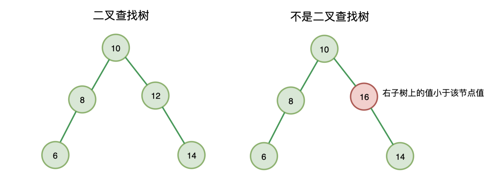
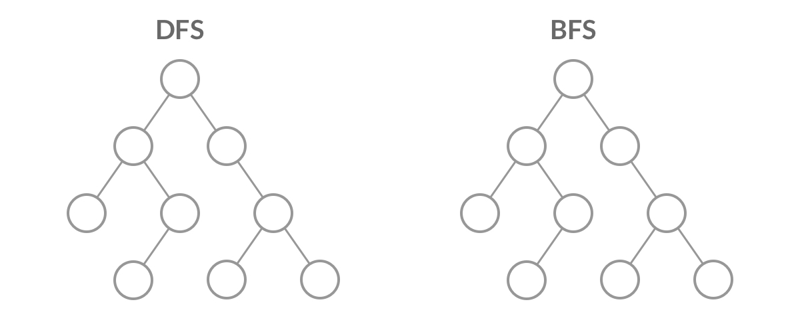

## 创建二叉树

```javascript
//构建一个二叉树(二叉链表)
function TreeNode(val, left, right) {
  this.val = val === undefined ? 0 : val;
  this.left = left === undefined ? null : left;
  this.right = right === undefined ? null : right;
}
```

```javascript
//构建一个二叉树(es6+数组)
class TreeNode {
  constructor(data) {
    this.data = data; //数据域
    this.lchild = null; //左孩子
    this.rchild = null; //右孩子
  }
}

export default class BinaryTree {
  constructor() {}
  arrayToTree(arr) {
    return createTreeNode(arr, 0);
  }
}

/**
创建树的结点：根据二叉树的性质递归来创建
第 index 个结点的左子节点的位置 = index *2
第 index 个结点的右子节点的位置 = index *2 +1
我们使用数组的下标来表示位置，从0开始，就得到： index *2 +1 ; index *2 +2
 */
function createTreeNode(arr, index) {
  if (index > arr.length) {
    return null;
  }
  if (arr[index] == null) {
    return null;
  }
  const node = new TreeNode(arr[index]);
  node.lchild = createTreeNode(arr, index * 2 + 1);
  node.rchild = createTreeNode(arr, index * 2 + 2);
  return node;
}
```

## BST 树 （二叉查找树）

二叉搜索树上的每个节点都需要满足：

- 左子节点值小于该节点值
- 右子节点值大于等于该节点值



## 二叉树的遍历

- 前序遍历
- 中序遍历
- 后序遍历
  所谓前、中、后，不过是根的顺序，即也可以称为先根遍历、中根遍历、后根遍历

```javascript
//例：先序遍历
function preOrderTraverse() {
  preOrderTraverseNode(root, callback);
}

function preOrderTraverseNode(node, callback) {
  if (node !== null) {
    // 先根节点
    callback(node.key);
    // 然后遍历左子树
    preOrderTraverseNode(node.left, callback);
    // 再遍历右子树
    preOrderTraverseNode(node.right, callback);
  }
}

function callback(key) {
  console.log(key);
}
```

## BFS DFS

- DFS（深度优先搜索）：沿着根节点递归下去，遇到叶子节点则向上回溯
- BFS (广度优先搜索)：按照二叉树的层次访问，通常采用队列保存每个层次的节点



页面结构如下

```html
<div id="root">
  <ul>
    <li>
      <a href="">
        
      </a>
    </li>
    <li>
      <span></span>
    </li>
    <li></li>
  </ul>
  <p></p>
  <button></button>
</div>
```

```javascript
// DFS 递归实现
function deepFirstSearch(node, nodeList) {
  if (node) {
    nodeList.push(node);
    let children = node.children;
    for (let i = 0; i < children.length; i++) {
      //每次递归的时候将 需要遍历的节点 和 节点所存储的数组传下去
      deepFirstSearch(children[i], nodeList);
    }
  }
  return nodeList;
}
// let root = document.getElementById('root')
// deepFirstSearch(root, nodeList=[])

// BFS 通常用队列
function breadthFirstSearch(node) {
  let nodes = [];
  if (node != null) {
    let queue = [];
    queue.unshift(node);
    while (queue.length != 0) {
      let item = queue.shift();
      nodes.push(item);
      let children = item.children;
      for (let i = 0; i < children.length; i++) queue.push(children[i]);
    }
  }
  return nodes;
}
// let root = document.getElementById('root')
// breadthFirstSearch(root)
```
