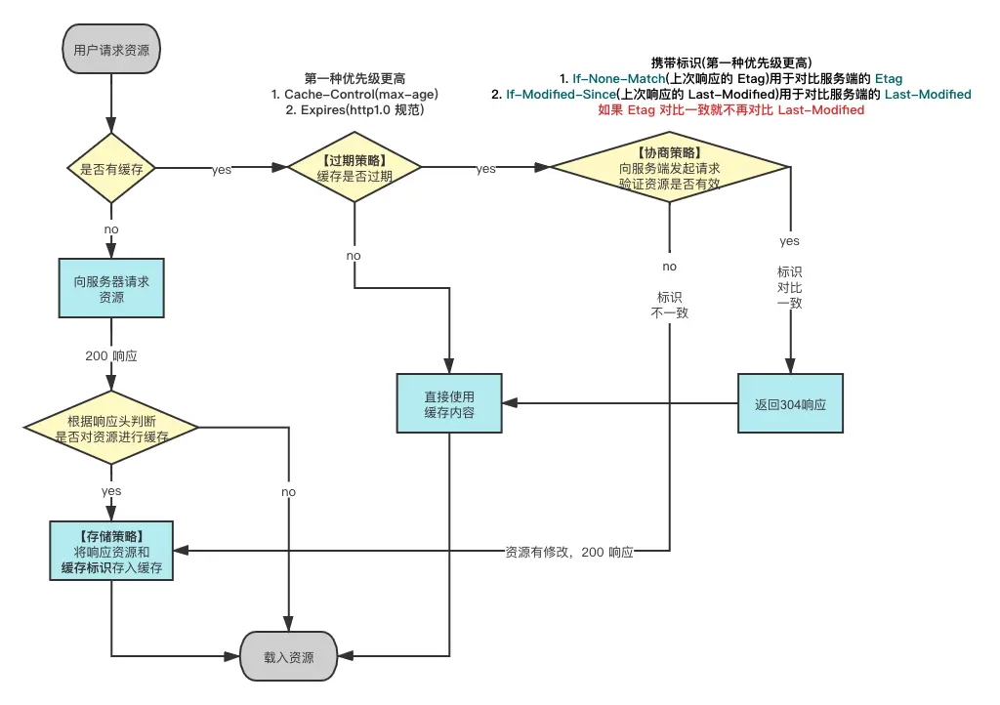

# 缓存机制

## 浏览器的缓存机制

简单来说，浏览器的响应头可能会返回如下四个字段：Cache-Control、Expires、ETag 和 Last-Modified（这四个字段，按照介绍的前后，优先级高的在前）。前面两个为强缓存，后两个为协议缓存。

- Cache-Control 提供丰富的缓存策略，可以如 no-cache 表示浏览器不要缓存，也可以如 max-age=3600 表示一个过期时间。
- Expires 则是单纯的标识，在指定时间之前，可以直接把缓存中的文件视为最新。
- ETag 是文件每次变化后，都会重新生成的文件指纹。
- Last-Modified 表示文件最后的修改时间，精确到秒。

**打开新标签页，输入 url 地址按回车时:**

1. 浏览器会先检测强缓存字段。
2. 如果没有过期，则直接采用缓存中的文件。
3. 没有命中强缓存，则进行协议缓存检测。
4. 如果有 Etag，则会将 Etag 的值，放到请求头 If-None-Match 中，交给服务器判断是否要重新下载。
5. 如果有 Last-Modified，则会将 Last-Modified 的值，放到 If-Modified-Since 中，同样交给服务器判断。

ps: 上面强调了，是打开新标签页的逻辑，是因为，在 chrome 中，通过 F5 之类的刷新操作，浏览器会忽略强缓存字段。

## http 缓存工作流程

参考: https://zhuanlan.zhihu.com/p/44789005
