# fiddler 使用详解

## fiddler 抓取 https 请求

### 一. 网页不安全

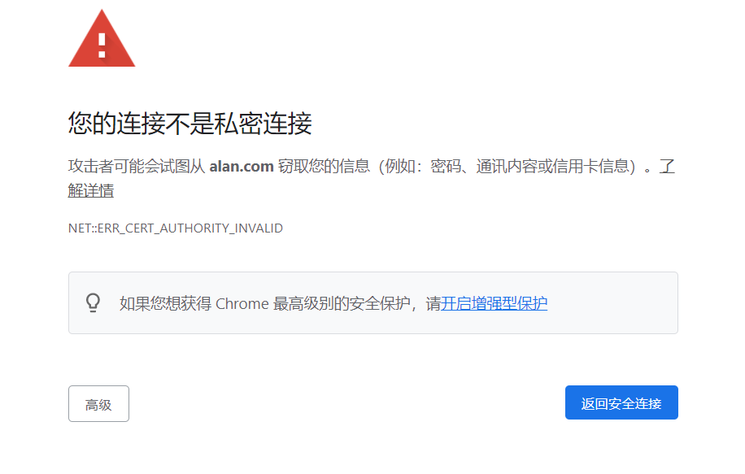

```
// 配置HOST
172.18.25.15 alan.com
```

- 如果没提示，可修改 chrome 配置，如下
  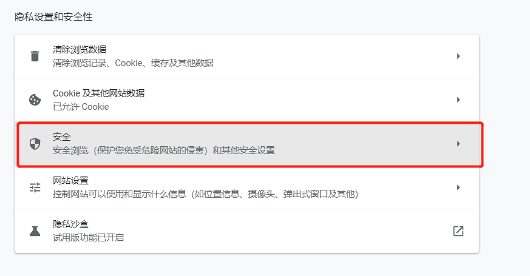
  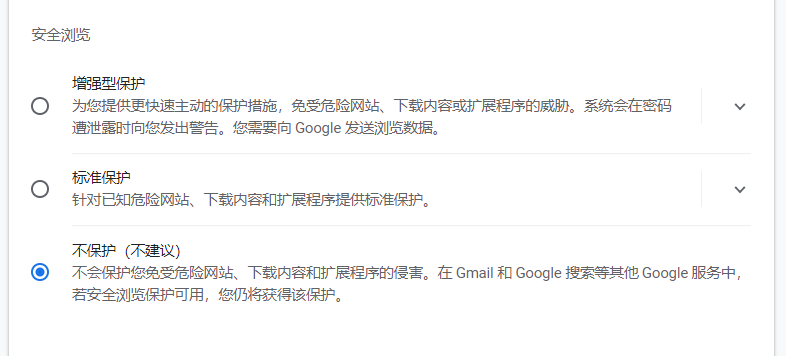

<!-- ### 工具介绍（request和response） -->

### 2. 工具简介

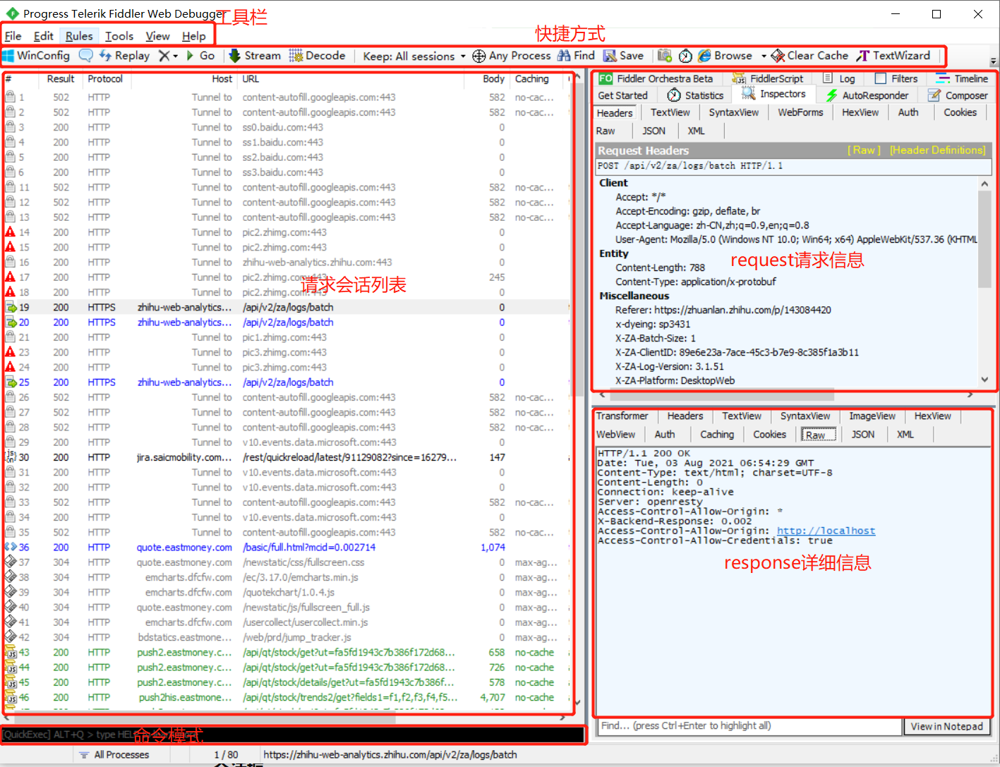

#### 2.1 工具栏

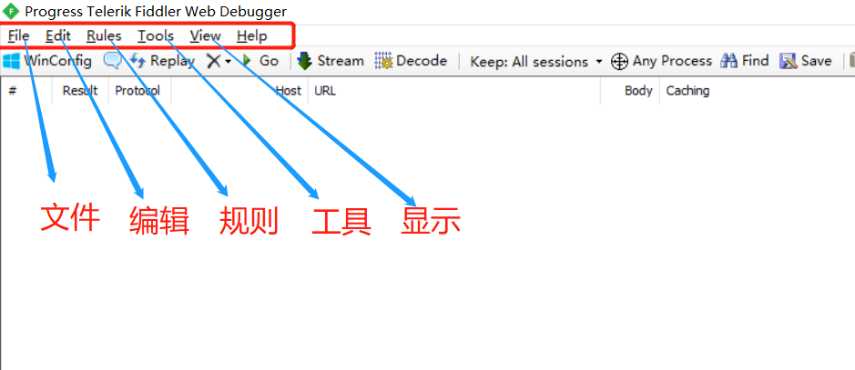

- file 文件 文件和 session 的导入导出
  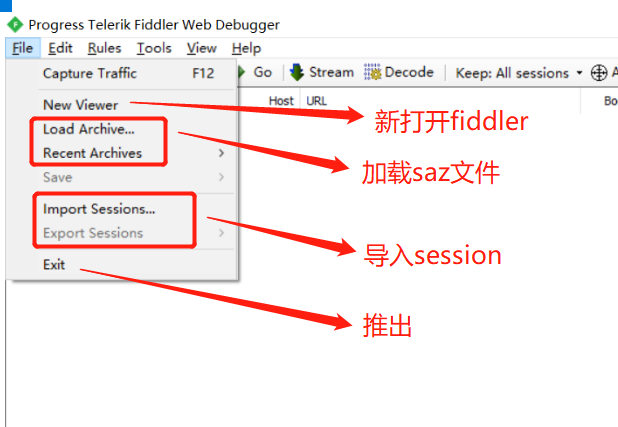

```
.saz  // Session Archive Zip 保存压缩后的http请求
```

- Edit 编辑
- Rules 规则
- Tools 工具
- View 显示
- Help 帮助

#### 2.2 会话框

1.会话框主要查看请求一些基本信息，如# 、result、protocol、host、url、body、 caching、content-type、process
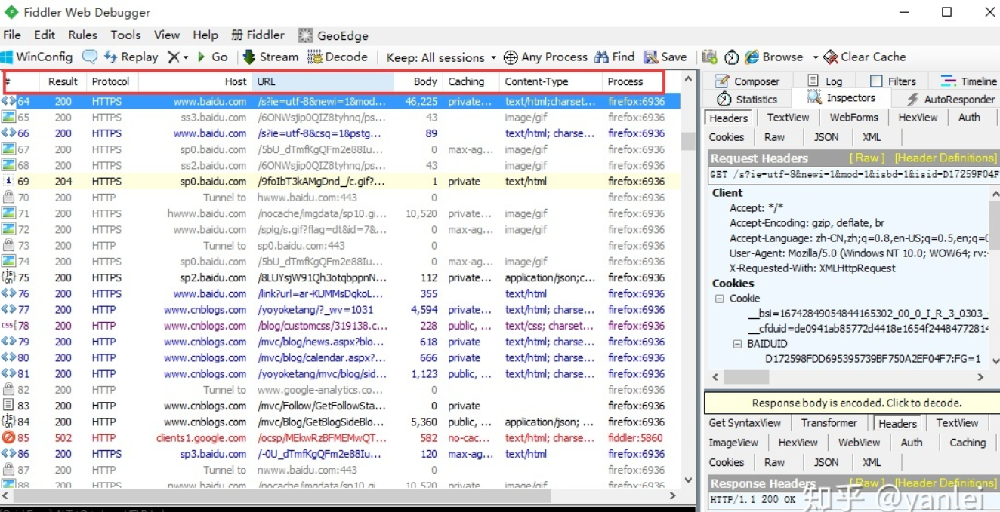

2.会话框列表最左侧
\#号这一栏是代表这个请求大概是什么内容，
<>这个符号就是我们一般要测试的请求与响应的类型。

3.**result**:这里是服务器返回的代码，如

- **200**，请求 ok;2xx 一般是服务器接受成功了并处理
- **3xx**，重定向相关
- **4xx**, 404 最常见的的就是找不到服务器,一般是请求地址有问题
- **5xx**, 这个一般是服务器本身的错误

  4.protocol：这个是协议类型，如 http、https
  5.host：主机地址或域名
  6.url:请求的路径
  7.body：该条请求产生的数据大小
  8.caching：缓存相关
  9.content-type：连接类型
  10.process:客户端类型

#### 2.3 Request 和 Response

1.Request 是客户端发出去的数据，Response 是服务端返回过来的数据，这两块区域功能差不多

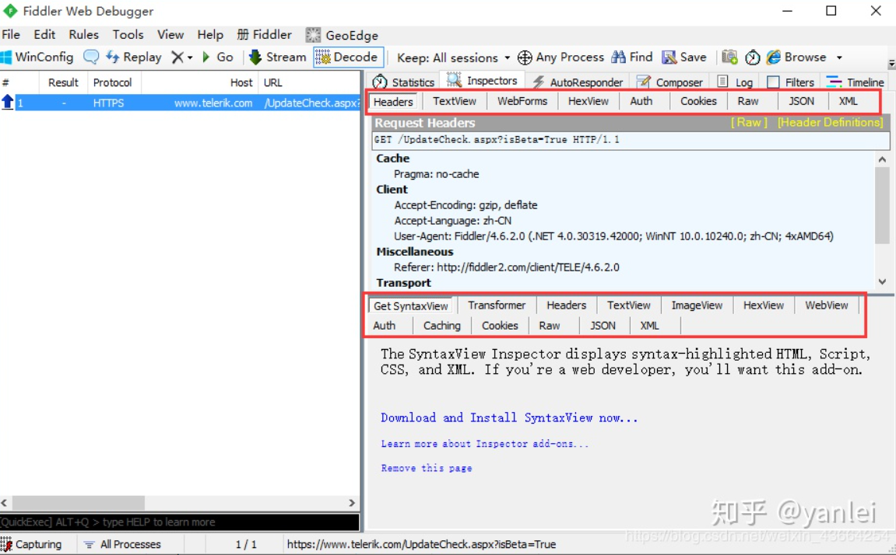

2.headers:请求头，这里包含 client、cookies、transport 等
3.webfroms：请求参数信息表格展示，更直观。可以直接该区域的参数, **可篡改 form 表单**
4.Auth:授权相关，如果显示如下两行，说明不需要授权，可以不用关注（这个目前很少见了）

- No Proxy-Authorization Header is present.
- No Authorization Headeris present.

  5.cookies:查看 cookie 详情
  6.raw:查看一个完整请求的内容，可以直接复制
  7.json:查看 json 数据
  8.xml:查看 xml 文件的信息

#### 2.4 decode 解码

1.如果 response 的 TextView 区域出现乱码情况，可以直接点下方黄色区域解码

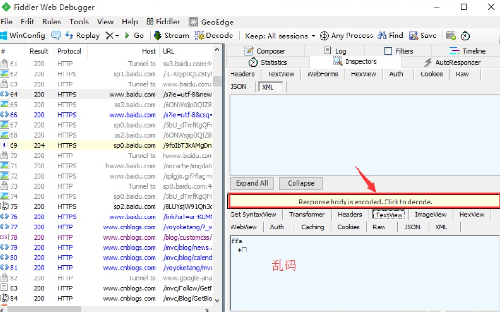

2.或者选中上方快捷菜单 decode，这样后面的请求都会自动解码了

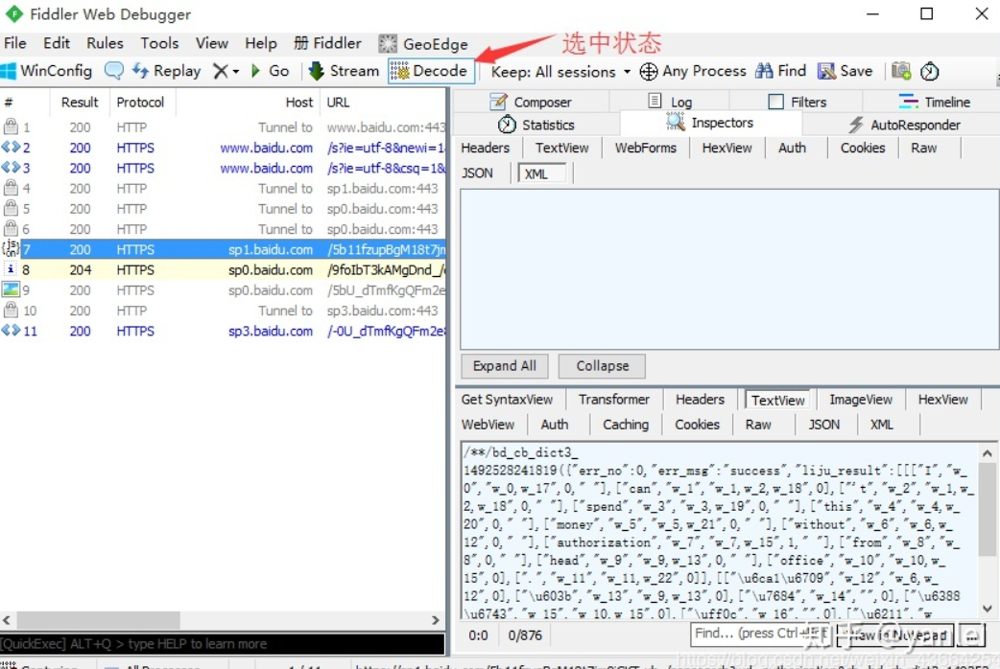

### 三. 接口测试（Composer）

Fiddler 最大的优势在于抓包，我们大部分使用的功能也在抓包的功能上，fiddler 做接口测试也是非常方便的。
对应没有接口测试文档的时候，可以直接抓完包后，copy 请求参数，修改下就可以了。

#### Composer 简介

```
// 案列demo
https://marketing-dev.saicmobility.com/mis-h5/couponPackageList
```

点开右侧 Composer 区域，可以看到如下界面，就是测试接口的界面了

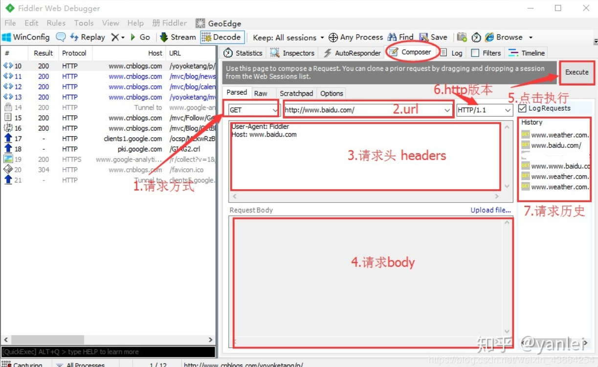

- 1.请求方式：点开可以勾选请求协议是 get、post 等
- 2.url 地址栏：输入请求的 url 地址
- 3.请求头：第三块区域可以输入请求头信息
- 4.请求 body：post 请求在此区域输入 body 信息
- 5.执行：Execute 按钮点击后就可以执行请求了
- 6.http 版本：可以勾选 http 版本
- 7.请求历史：执行完成后会在右侧 History 区域生成历史记录

```
直接在fiddler里把请求拖拽过去可以了
主要用途：测试接口请求
```

### 模拟 get 请求

1.在 Composer 区域地址栏输入博客首页：https://www.baidu.com/ 2.选择 get 请求，点 Execute 执行，请求就可以发送成功啦 3.请求发送成功后，左边会话框会生成一个会话记录，可以查看抓包详情(双击) 4.右侧 history 区域会多一个历史请求记录 5.会话框选中该记录，查看测试结果：

- 选中该会话，点开 Inspectors
- response 区域点开 Raw 区域
- Raw 查看的是 HTML 源码的数据

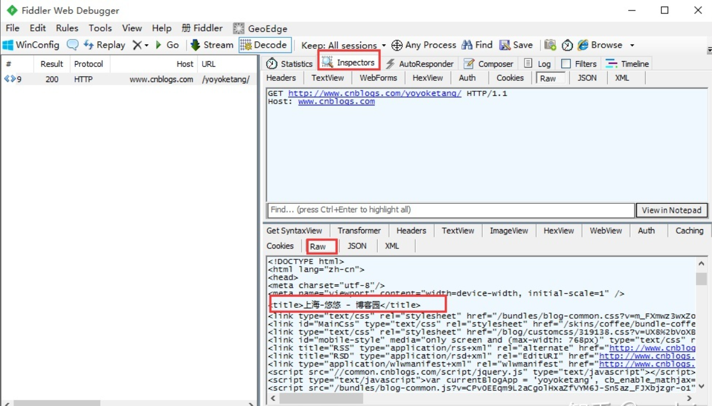

- 也可以点 WebView，查看返回的 web 页面数据

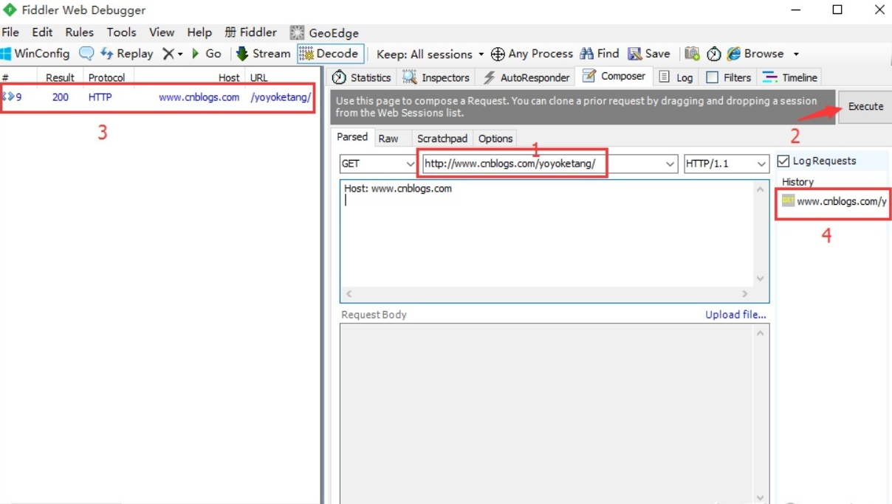

### 模拟 post 请求

1.请求类型勾选 post
2.url 地址栏输入对应的请求地址
3.body 区域写登录的 json 参数，json 参数直接 copy 上一步抓包的数据，如下图红色区域
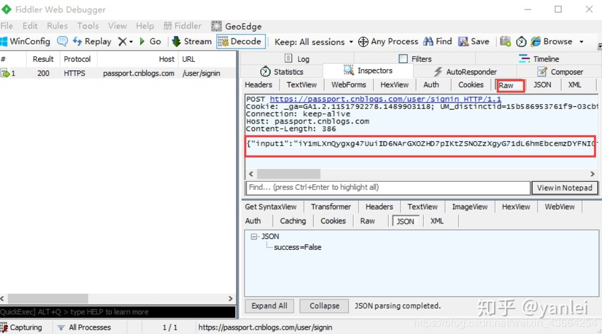

4.header 请求头区域，可以把前面登录成功后的头部抓包的数据 copy 过来
（注意，有些请求如果请求头为空的话，会请求失败的）
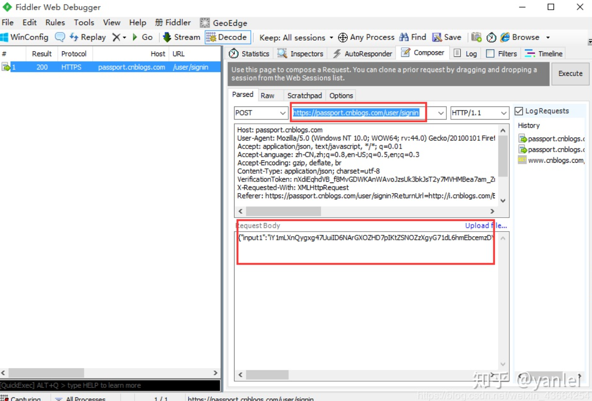

5.执行成功后查看测试结果：
– 执行成功如第三所示的图，显示 success=True
– 执行失败如下图所示，显示
message=Invalid length for a Base-64 char array or string.
success=False

### 二. fiddler 设置

1.打开菜单栏：Tools>Fiddler Options>HTTPS 2.勾选 Decrypt HTTPS traffic，里面的两个子菜单也一起勾选了

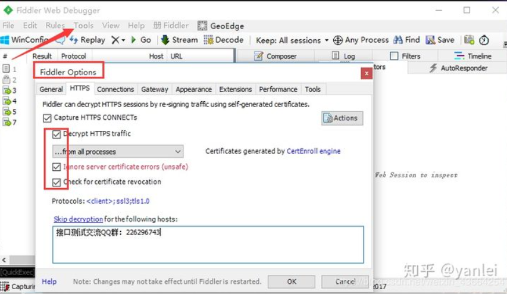

### 三. 导出证书

1.点右上角 Actions 按钮 2.选第二个选项，导出到桌面，此时桌面上会多一个文件：FiddlerRoot.cer,如图。

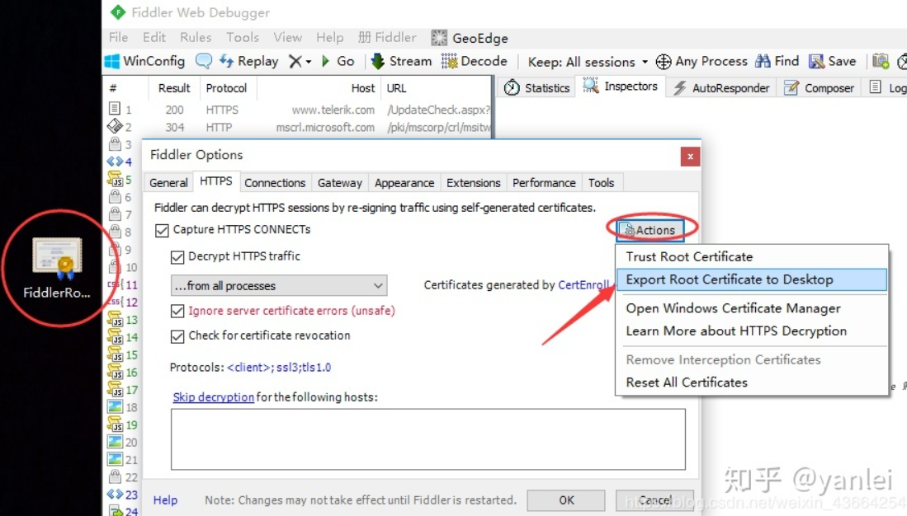

### 四. 导入到浏览器

1.打开右上角浏览器设置》选项》高级》证书》查看证书》证书机构》导入

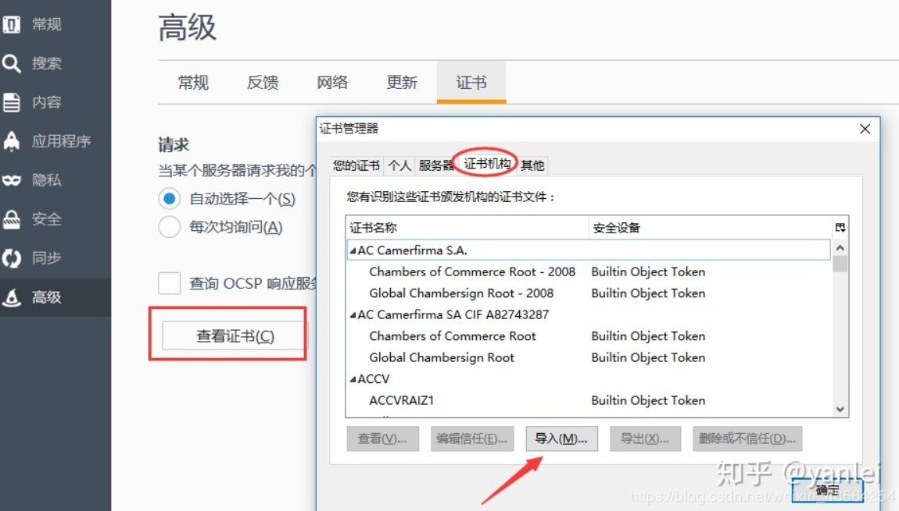

2.勾选文件导入

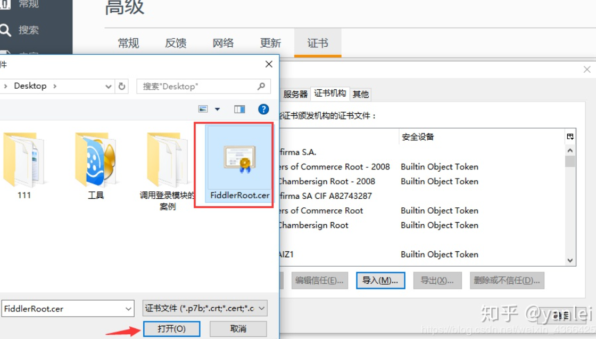

3.打开文件后，会弹出个框，勾选三个选项就完成操作啦。

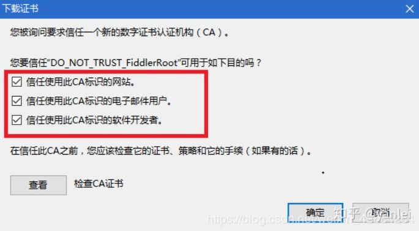

```
ps: 不生效重启浏览器
```

### 五. 抓取 app 请求

##### 前言

fiddler 在抓手机 app 的请求时候，通常也会抓到来自 PC 的请求，导致会话消息太多，那么如何把来自 pc 的请求过滤掉，只抓来自 APP 的请求呢？
必备环境： 1.电脑上已装 fiddler 2.手机和电脑在同一局域网

##### 设置

1.fiddler>Tools>Fiddler Options>Connections 勾选 Allow remote computers to connect。

2.记住这里的端口号：8888，后面会用到。

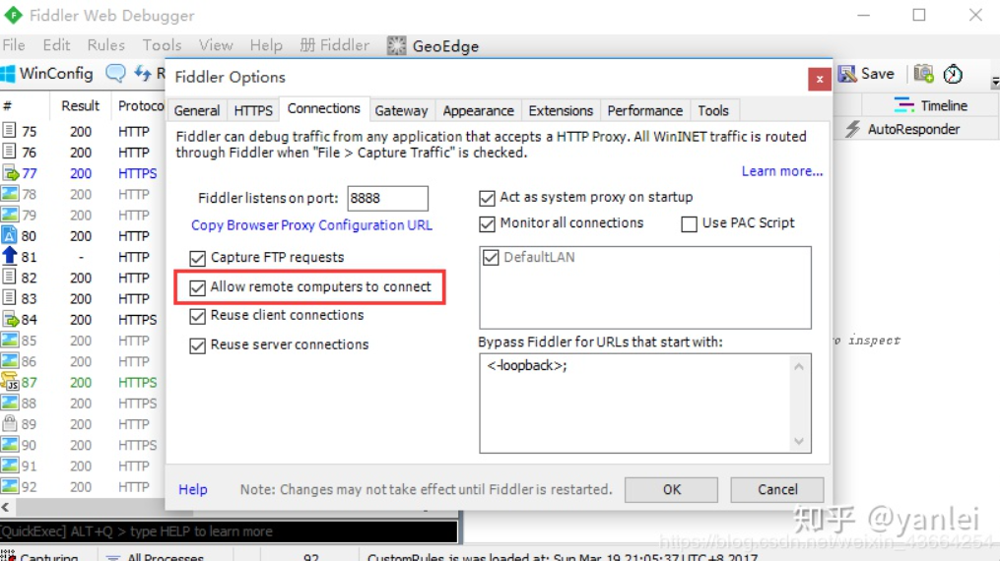

**查看电脑 IP** 1.打开 cmd，输入：ipconfig,记住这个 IPv4 地址。

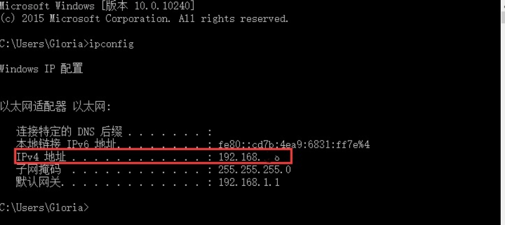

**设置代理**

1.手机设置->WLAN 设置->选择该 wifi，点右边的箭头（有的手机是长按弹出选项框）。

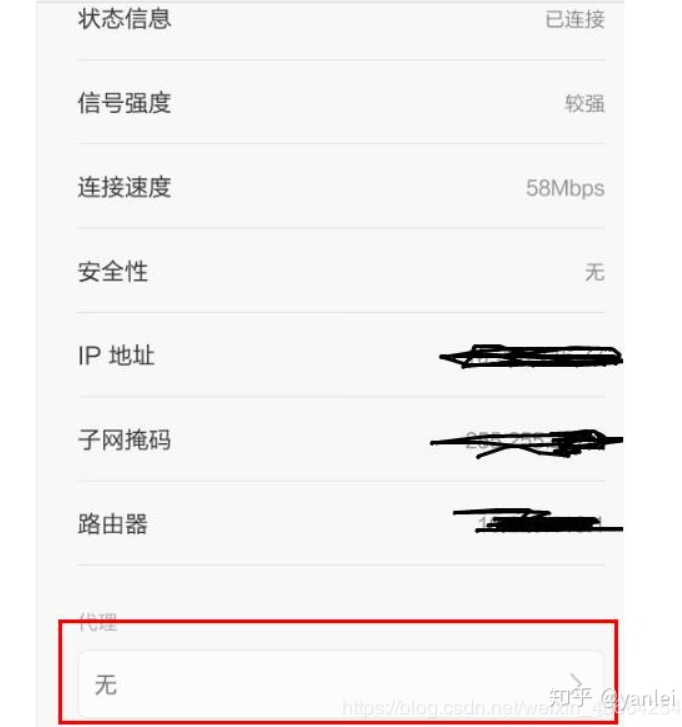

**抓 APP 上的 HTTPS 请求**

1.如果 app 都是 http 请求，是不需要安装证书，能直接抓到的，如果是 https 请求，这时候手机就需要下载证书了。

2.打开手机浏览器输入：http://10.224.xx.xx:8888 ，这个中间的 host 地址就是前面查到的本机地址。

3.出现如下画面，点箭头所指的位置，点击安装就可以了。

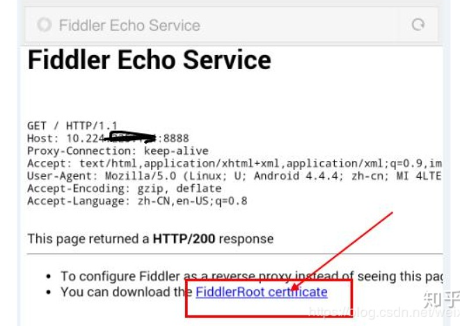

#### 设置过滤

1.手机上设置代理后，这时候 fiddler 上抓到的是 pc 和 app 所有的请求，如果 pc 上打开网址，会很多，这时候就需要开启过滤功能了。

2.打开 fiddler>Tools>Fiddler Options>HTTPS>…from remote clients only,勾选这个选项就可以了

```
from all processes :抓所有的请求
from browsers only ：只抓浏览器的请求
from non-browsers only :只抓非浏览器的请求
from remote clients only:只抓远程客户端请求

```

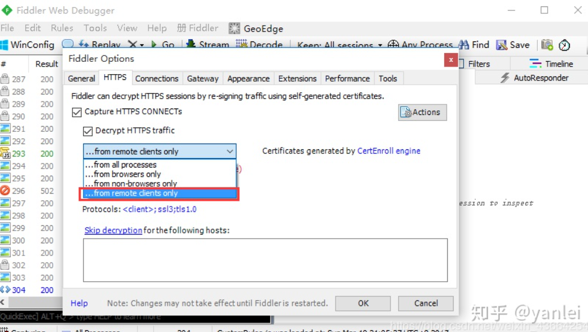

### get 请求

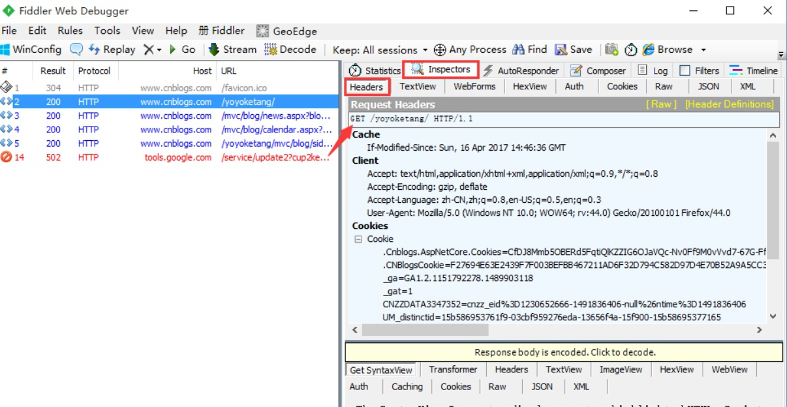

### post 请求

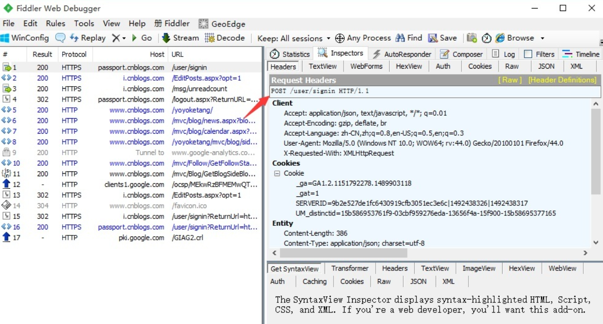

### 如何找出需要的请求？

1.打开 fiddler 后，左边会话框区域刷刷刷的很多请求，那么如何有效的找出自己需要的请求呢？ 2.首先第一步：清屏（cls）,在左下角命令行输入 cls，清空屏幕
（清屏也可以使用快捷键 Ctrl+X）

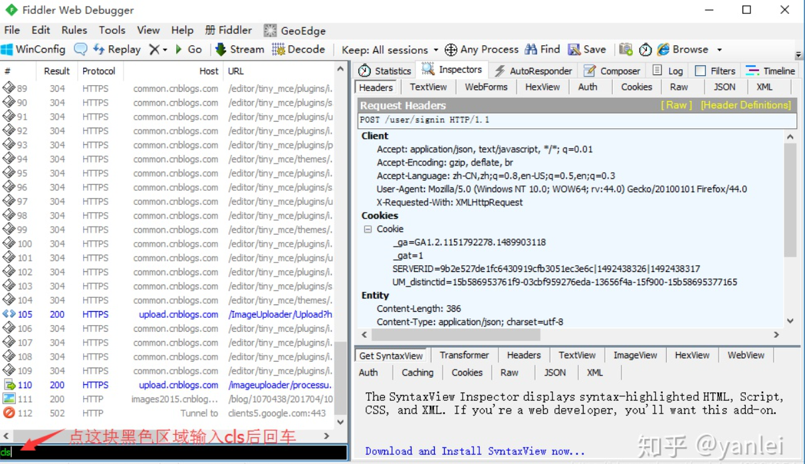

3.第二步在浏览器输入 url 地址的时候，记住这个地址，如打开博客首页：http://www.cnblogs.com/yoyoketang/
在点击登录按钮的时候，不要做多余的操作了，然后查看 fiddler 会话框，这时候有好几个请求。

4.如上图，红色框框这个地方就是 host 地址，红色圈圈地方就是 url 的路径（yoyoketang），也就是博客首页的地址了，那这个请求就是博客首页的请求了。

### 比较 get 和 post 请求

### 如何修改请求

bpu

## 产线代码调试

### 方式一：fiddler

### 方式二

SourceMapDevToolPlugin

#### 先看效果

- 配置前

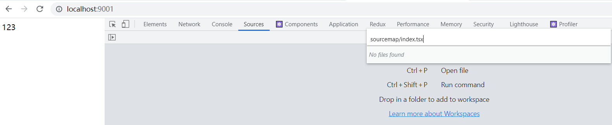

- 配置后

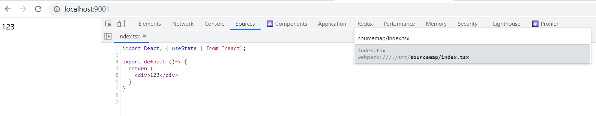

#### 1. 配置 webpack.prod.js

```js
// webpack.prod.js
{
  devtool: false,
  plugins: [
    new webpack.SourceMapDevToolPlugin({
      filename: 'sourcemaps/[file].map',
      publicPath: 'http://fakesourcemap.com/',  // sourcemap请求地址
    })
  ]
}
```

#### 2. 代理劫持(fiddler/charles)

```
regex:(?inx)^http://fakesourcemap.com/(?<args>.*)$
->
http://localhost:9011/${args}
```

如下图：
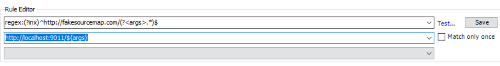
