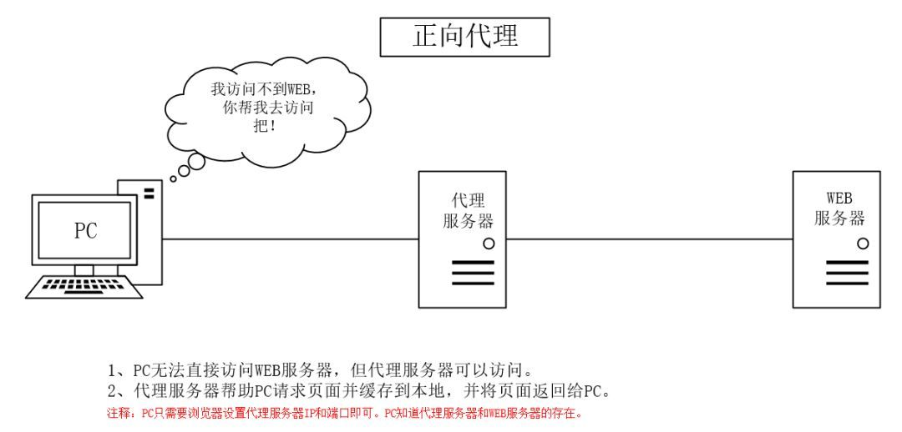

# 正向代理 & 反向代理

## 正向代理

是一个位于客户端和目标服务器之间的服务器(代理服务器)，为了从目标服务器取得内容，客户端向代理服务器发送一个请求并指定目标，然后代理服务器向目标服务器转交请求并将获得的内容返回给客户端。

正向代理的过程其实和租房子很像。

租房子的时候，一般情况下，我们很难联系到房东，因为有些房东为了图方便，只把自己的房屋信息和钥匙交给中介了。而房客想要租房子，只能通过中介才能联系到房东。而对于房东来说，他可能根本不知道真正要租他的房子的人是谁，他只知道是中介在联系他。

这里面一共有三个角色，租客（用户）、中介（代理服务器）和房东（国外网站，目标服务器）。引入中介（代理服务器）的原因是用户无法联系上房东（用户无法访问国外网站）。

例：翻墙软件

用途：

- 突破访问限制，国外网站等。
- 提高访问速度：通常代理服务器都设置一个较大的硬盘缓冲区，会将部分请求的响应保存到缓冲区中，当其他用户再访问相同的信息时， 则直接由缓冲区中取出信息，传给用户，以提高访问速度。
- 隐藏客户端真实 IP

## 反向代理

是指以代理服务器来接受 internet 上的连接请求，然后将请求转发给内部网络上的服务器，并将从服务器上得到的结果返回给 internet 上请求连接的客户端，此时代理服务器对外就表现为一个反向代理服务器。

还是租房子。

我们在租房子的过程中，除了有些房源需要通过中介以外，还有一些是可以直接通过房东来租的。用户直接找到房东租房的这种情况就是我们不使用代理直接访问国内的网站的情况。

还有一种情况，就是我们以为我们接触的是房东，其实有时候也有可能并非房主本人，有可能是他的亲戚、朋友，甚至是二房东。但是我们并不知道和我们沟通的并不是真正的房东。这种帮助真正的房主租房的二房东其实就是反向代理服务器。这个过程就是反向代理。

所以，反向代理，其实是"代理服务器"代理了"目标服务器"，去和"客户端"进行交互。

例：nginx

用途：

- 隐藏服务器真实 IP
- 提高访问速度：反向代理服务器可以对于静态内容及短时间内有大量访问请求的动态内容提供缓存服务，提高访问速度。
- 负载均衡
- 提供安全保障: 反向代理服务器可以作为应用层防火墙，为网站提供对基于 Web 的攻击行为（例如 DoS/DDoS）的防护，更容易排查恶意软件等。还可以为后端服务器统一提供加密和 SSL 加速（如 SSL 终端代理），提供 HTTP 访问认证等。

## 总结区别

### 正向代理和反向代理的区别

虽然正向代理服务器和反向代理服务器所处的位置都是客户端和真实服务器之间，所做的事情也都是把客户端的请求转发给服务器，再把服务器的响应转发给客户端，但是二者之间还是有一定的差异的，具体如下：

- 正向代理其实是客户端的代理，帮助客户端访问其无法访问的服务器资源。反向代理则是服务器的代理，帮助服务器做负载均衡，安全防护等。
- 正向代理一般是客户端架设的，比如在自己的机器上安装一个代理软件。而反向代理一般是服务器架设的，比如在自己的机器集群中部署一个反向代理服务器。
- 正向代理中，服务器不知道真正的客户端到底是谁，以为访问自己的就是真实的客户端。而在反向代理中，客户端不知道真正的服务器是谁，以为自己访问的就是真实的服务器。
- 正向代理和反向代理的作用和目的不同。正向代理主要是用来解决访问限制问题。而反向代理则是提供负载均衡、安全防护等作用。二者均能提高访问速度。
