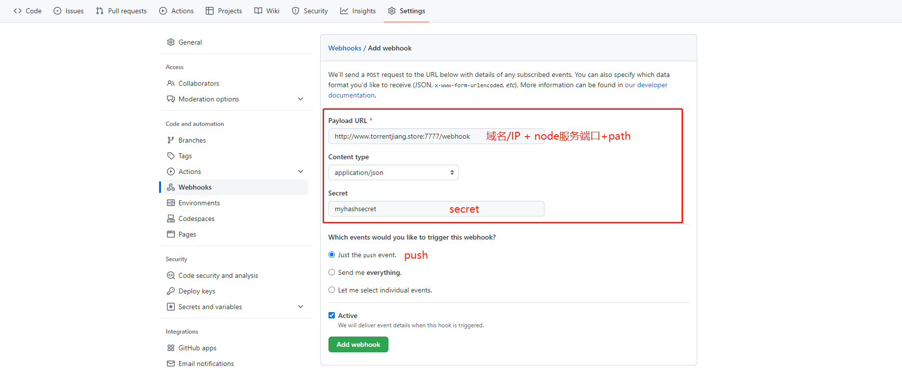
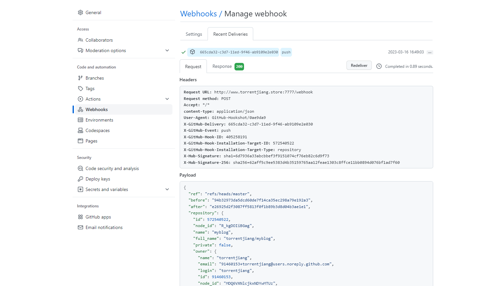
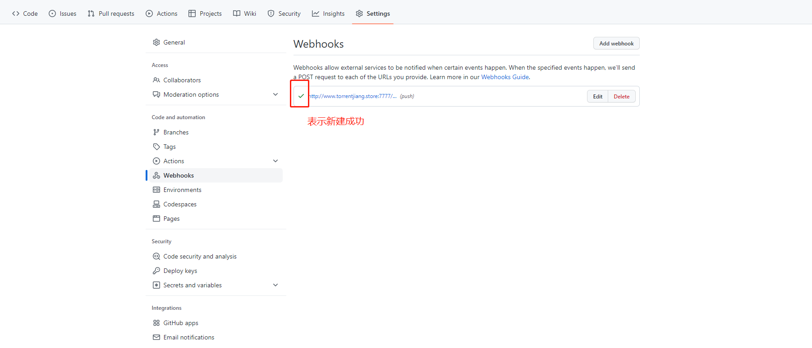

# webhook 实现前端自动化部署

## 传统的前端开发部署流程

随着前端工程化的推进，现在的前端开发流程已经日趋规范化，在我们的日常开发中，每完成一次功能的开发，一般需要经过以下步骤:

1. Git 提交代码
2. webpack 打包源码
3. 上传服务器
4. 重启服务器上部署的服务(例如 Nginx)

`缺点：每一步都需要手动执行，繁琐且效率低下。`

## webhook 是什么

维基百科：在 Web 开发中，Webhook 是通过自定义回调来增强或改变网页或 Web 应用程序行为的一种方法。这些回调可能由第三方用户和开发人员维护、修改和管理，他们不一定与源网站或应用程序有关联。Webhook 是由 Jeff Lindsay 于 2007 年从计算机编程术语 hook 中创造的。

## 实战项目配置 webhook

### 1. 项目初始化

我这里初始化了一个由[dumi 2.0](https://d.umijs.org/)搭建的一个文档站点，github 地址：https://github.com/torrentjiang/myblog
然后把项目上传到服务器上，并打包完成。

### 2. 配置 nginx

本项目服务器环境使用 nginx 作为代理服务器运行，需要在 nginx 配置中设置目录指向项目的 webdocs-dist 目录(项目配置文件设定的打包出来的目录名称)，即可正常访问[web 站点](http://www.torrentjiang.store/)。

nginx 配置如下

```
    location / {
        root   /root/torrent_blog/myblog/webdocs-dist/;
        index  index.html index.htm;
    }
```

### 3. 项目配置自动化部署脚本

在对应项目的根目录，新建一个 autoBuild.sh 自动化脚本。

实现如下步骤：

1. 监听到 git push 操作后，执行 git pull 获取最新的代码；
2. 运行 npm install，项目可能会有新加的 npm 包；
3. 执行打包命令 npm run docs:build(具体看项目)，输出打包文件夹;
4. 重启 nginx （前端服务貌似不需要）

```
// autoBild.sh
git pull origin master       # 拉取最新代码
npm install                  # 安装依赖
npm run docs:build           # 打包
cd /usr/local/sbin/          # 重启nginx (静态web服务可忽略)
./nginx -s reload
```

### 4. 项目配置 webhook 服务

在对应项目的根目录，新建一个 autoBuild.js, 开启一个 node 服务, 用于监听 webhook 的 post 请求。

代码如下：

```javascript
// autoBuild.js
const http = require('http');
const createHandler = require('github-webhook-handler');
const handler = createHandler({
  path: '/webhook', // 在哪用下一节介绍
  secret: 'myhashsecret',
});

http
  .createServer(function (req, res) {
    handler(req, res, function (err) {
      res.statusCode = 404;
      // res.end('no such location');
    });
  })
  .listen(7777);

handler.on('error', function (err) {
  console.error('Error:', err.message);
});

handler.on('push', function (event) {
  console.log(
    'Received a push event for %s to %s',
    event.payload.repository.name,
    event.payload.ref,
  );
  // 执行autoBuild.sh
  run_cmd('sh', ['./autoBuild.sh'], function (text) {
    console.log(text);
  });
});

// 新增run_cmd 执行脚本函数
function run_cmd(cmd, args, callback) {
  let spawn = require('child_process').spawn;
  let child = spawn(cmd, args);
  let resp = '';

  child.stdout.on('data', function (buffer) {
    resp += buffer.toString();
  });
  child.stdout.on('end', function () {
    callback(resp);
  });
}
```

启动服务：

```
node autoBild.js
```

### 4. github webhook 设置

1. 配置 webhook
   
2. 发送测试 post
   
3. 显示发送成功
   
4. 服务器接收成功，自动执行脚本，完成部署打包

### 5. 总结

到这里，使用 github 提供的 Webhooks 来实现前端自动化部署就已经大致完成了，一些细节的地方还可以继续优化，能实现的不止这些，下面记录可优化的点：

1. 可以在 autoBuild.sh 文件中加入单元测试；
2. 完善 node 服务，可实现针对指定 commit 内容或者指定提交人实现部署流程，并非每次 git push 都完成部署；
3. 服务部署日志记录；
4. 部署回滚机制。
